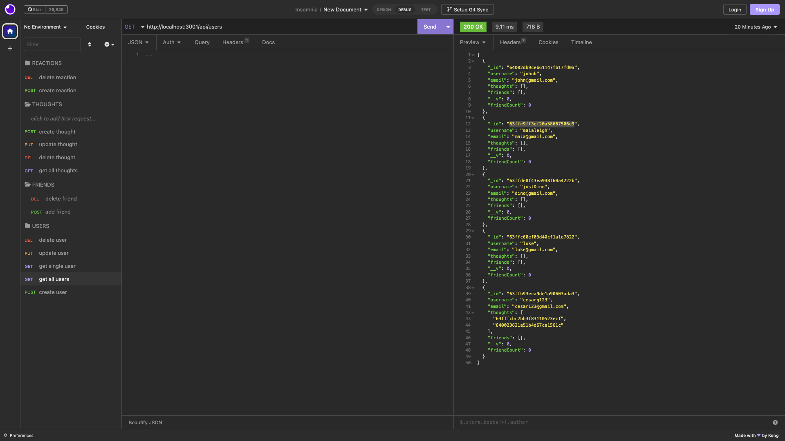

# NoSql-social-network-API

[](https://github.com/Naereen/StrapDown.js/blob/master/LICENSE)



## Project Description

This is a test task for a future social network built without any starter code. Given the routes developed, the current functions include; creating a user, updating a user, the users elgibility to create thoughts and reactions, which can up updated and deleted as well. Currently, there is no front end interface.

All routes were tested using Insomnia which you can check out [HERE](https://www.youtube.com/watch?v=AjmnPAGOa6U) !

## Installation & Usage

1. User must first install the `inquierer` using the following command in the integrated terminal:
   `npm i inquirer`

2. The server will then be invoked using the following command:
   `npm start`

3. Then, the user must open insomnia to use the following routes.

## User Story

```
AS A social media startup
I WANT an API for my social network that uses a NoSQL database
SO THAT my website can handle large amounts of unstructured data

```

## Acceptance Criteria

```
GIVEN a social network API
WHEN I enter the command to invoke the application
THEN my server is started and the Mongoose models are synced to the MongoDB database
WHEN I open API GET routes in Insomnia for users and thoughts
THEN the data for each of these routes is displayed in a formatted JSON
WHEN I test API POST, PUT, and DELETE routes in Insomnia
THEN I am able to successfully create, update, and delete users and thoughts in my database
WHEN I test API POST and DELETE routes in Insomnia
THEN I am able to successfully create and delete reactions to thoughts and add and remove friends to a user’s friend list

```

## Important Links

- [GitHub Repository](https://github.com/maiaferrer/NoSql-social-network-API)
- [Demo](https://www.youtube.com/watch?v=AjmnPAGOa6U)

## Technology used

- mongoose


## Contact Me

For further quesitons contact me at: maiaferrer604@gmail.com or
[Github](https://github.com/maiaferrer) or
[Linkedin](https://www.linkedin.com/in/maia-f-2b7aa710a)
